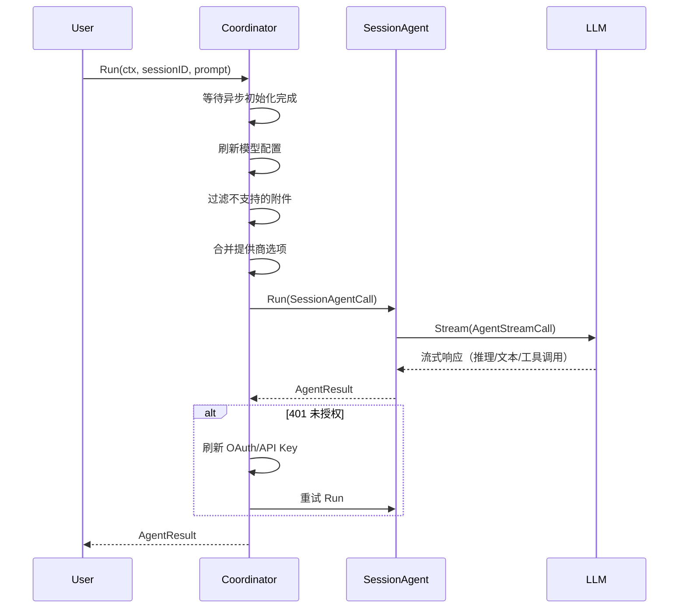
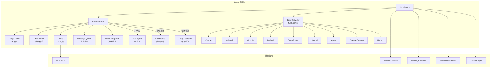

# Agent 包接口文档

> 包路径：`github.com/charmbracelet/crush/internal/agent`

Agent 包是 Crush AI 编码助手的核心编排层，提供基于会话的 AI 代理功能，负责管理对话、工具执行和消息处理。

---

## 接口总览

| 接口/类型 | 描述 | 稳定性 |
|-----------|------|--------|
| [`Coordinator`](#coordinator) | Agent 协调器顶层接口 | Stable |
| [`SessionAgent`](#sessionagent) | 会话级 AI 代理接口 | Stable |
| [`Model`](#model) | 语言模型配置封装 | Stable |
| [`SessionAgentCall`](#sessionagentcall) | Agent 调用参数 | Stable |
| [`SessionAgentOptions`](#sessionagentoptions) | Agent 创建选项 | Stable |
| [`NewCoordinator`](#newcoordinator) | 创建协调器 | Stable |
| [`NewSessionAgent`](#newsessionagent) | 创建会话代理 | Stable |
| [`InitializePrompt`](#initializeprompt) | 构建初始化提示词 | Stable |

---

## Coordinator

协调器是 Agent 系统的顶层编排器，负责管理 Agent 实例的创建和配置、协调模型和工具的构建、处理 OAuth 令牌刷新和 API Key 更新。

### 接口定义

```go
type Coordinator interface {
    Run(ctx context.Context, sessionID, prompt string, attachments ...message.Attachment) (*fantasy.AgentResult, error)
    Cancel(sessionID string)
    CancelAll()
    IsSessionBusy(sessionID string) bool
    IsBusy() bool
    QueuedPrompts(sessionID string) int
    QueuedPromptsList(sessionID string) []string
    ClearQueue(sessionID string)
    Summarize(context.Context, string) error
    Model() Model
    UpdateModels(ctx context.Context) error
}
```

### 方法说明

#### `Run`

在指定会话中执行一次 Agent 调用。

```go
func Run(ctx context.Context, sessionID, prompt string, attachments ...message.Attachment) (*fantasy.AgentResult, error)
```

**参数说明：**

| 参数 | 类型 | 必填 | 描述 |
|------|------|------|------|
| ctx | `context.Context` | 是 | 上下文，用于取消控制 |
| sessionID | `string` | 是 | 目标会话的唯一标识 |
| prompt | `string` | 是 | 用户输入的提示词文本 |
| attachments | `...message.Attachment` | 否 | 用户附带的文件（图片、文档等） |

**返回值：**

| 返回值 | 类型 | 描述 |
|--------|------|------|
| result | `*fantasy.AgentResult` | Agent 执行结果，包含最终响应和使用量统计 |
| err | `error` | 执行错误（用户取消、权限拒绝、提供商错误等） |

**执行流程：**



**使用示例：**

```go
// 基本用法
result, err := coordinator.Run(ctx, "session-123", "帮我写一个 HTTP 服务器")
if err != nil {
    log.Fatal(err)
}
fmt.Println(result.Response.Content.Text())

// 带附件的用法
attachment := message.Attachment{
    FileName: "screenshot.png",
    MimeType: "image/png",
    Content:  imageBytes,
}
result, err := coordinator.Run(ctx, "session-123", "分析这张截图", attachment)
```

**错误处理：**

- `context.Canceled`：用户主动取消请求
- `permission.ErrorPermissionDenied`：用户拒绝工具执行权限
- `*fantasy.ProviderError`：LLM 提供商返回的错误（如 401、429 等）
- `hyper.ErrNoCredits`：Hyper 提供商额度不足

---

#### `Cancel`

取消指定会话的当前请求。

```go
func Cancel(sessionID string)
```

**使用示例：**

```go
coordinator.Cancel("session-123")
```

---

#### `CancelAll`

取消所有活跃会话的请求。

```go
func CancelAll()
```

---

#### `IsSessionBusy` / `IsBusy`

检查会话或全局的忙碌状态。

```go
func IsSessionBusy(sessionID string) bool
func IsBusy() bool
```

**使用示例：**

```go
if coordinator.IsSessionBusy("session-123") {
    fmt.Println("会话正忙，请求将被排队")
}
```

---

#### `QueuedPrompts` / `QueuedPromptsList`

查询指定会话的排队请求信息。

```go
func QueuedPrompts(sessionID string) int
func QueuedPromptsList(sessionID string) []string
```

---

#### `ClearQueue`

清空指定会话的消息队列。

```go
func ClearQueue(sessionID string)
```

---

#### `Summarize`

对指定会话进行摘要压缩，释放上下文空间。

```go
func Summarize(ctx context.Context, sessionID string) error
```

**注意事项：**
- 如果会话正忙，返回 `ErrSessionBusy`
- 摘要消息会替代之前的所有历史消息
- 如果会话包含 TODO 列表，摘要中会包含任务状态

---

#### `Model`

返回当前使用的模型配置。

```go
func Model() Model
```

---

#### `UpdateModels`

重新构建并更新 Agent 的模型和工具配置。在每次 `Run` 调用前自动执行。

```go
func UpdateModels(ctx context.Context) error
```

---

## NewCoordinator

创建并初始化一个新的 Agent 协调器。

### 函数签名

```go
func NewCoordinator(
    ctx context.Context,
    cfg *config.ConfigStore,
    sessions session.Service,
    messages message.Service,
    permissions permission.Service,
    history history.Service,
    filetracker filetracker.Service,
    lspManager *lsp.Manager,
    notify pubsub.Publisher[notify.Notification],
) (Coordinator, error)
```

### 参数说明

| 参数 | 类型 | 必填 | 描述 |
|------|------|------|------|
| ctx | `context.Context` | 是 | 上下文 |
| cfg | `*config.ConfigStore` | 是 | 全局配置存储 |
| sessions | `session.Service` | 是 | 会话持久化服务 |
| messages | `message.Service` | 是 | 消息持久化服务 |
| permissions | `permission.Service` | 是 | 工具权限管理服务 |
| history | `history.Service` | 是 | 文件编辑历史服务 |
| filetracker | `filetracker.Service` | 是 | 文件跟踪服务 |
| lspManager | `*lsp.Manager` | 是 | LSP 服务管理器 |
| notify | `pubsub.Publisher[notify.Notification]` | 是 | 桌面通知发布器 |

### 错误处理

- `errCoderAgentNotConfigured`：配置中缺少 Coder Agent 定义

### 使用示例

```go
coordinator, err := agent.NewCoordinator(
    ctx, cfg, sessions, messages,
    permissions, history, filetracker,
    lspManager, notifyPublisher,
)
if err != nil {
    log.Fatal("创建协调器失败:", err)
}

// 执行 Agent 调用
result, err := coordinator.Run(ctx, sessionID, "你好")
```

---

## SessionAgent

会话级 AI 代理接口，负责管理单个 Agent 实例的生命周期。

### 接口定义

```go
type SessionAgent interface {
    Run(context.Context, SessionAgentCall) (*fantasy.AgentResult, error)
    SetModels(large Model, small Model)
    SetTools(tools []fantasy.AgentTool)
    SetSystemPrompt(systemPrompt string)
    Cancel(sessionID string)
    CancelAll()
    IsSessionBusy(sessionID string) bool
    IsBusy() bool
    QueuedPrompts(sessionID string) int
    QueuedPromptsList(sessionID string) []string
    ClearQueue(sessionID string)
    Summarize(context.Context, string, fantasy.ProviderOptions) error
    Model() Model
}
```

### 核心特性

- **消息排队**：当会话正忙时，新请求自动入队，待当前请求完成后依次处理
- **自动摘要**：当上下文窗口使用量接近阈值时，自动触发会话摘要
- **循环检测**：检测重复的工具调用模式，防止 Agent 陷入死循环
- **并发安全**：所有可变字段通过 `csync` 包装器保护，支持运行时动态更新

### 自动摘要阈值

| 上下文窗口大小 | 触发条件 |
|----------------|----------|
| > 200,000 Token | 剩余 < 20,000 Token |
| ≤ 200,000 Token | 剩余 < 20% |

---

## NewSessionAgent

创建并返回一个新的 SessionAgent 实例。

### 函数签名

```go
func NewSessionAgent(opts SessionAgentOptions) SessionAgent
```

### 使用示例

```go
agent := agent.NewSessionAgent(agent.SessionAgentOptions{
    LargeModel:           largeModel,
    SmallModel:           smallModel,
    SystemPromptPrefix:   "你是一个编程助手",
    SystemPrompt:         systemPrompt,
    IsSubAgent:           false,
    DisableAutoSummarize: false,
    IsYolo:               false,
    Sessions:             sessionService,
    Messages:             messageService,
    Tools:                tools,
    Notify:               notifyPublisher,
})
```

---

## Model

封装语言模型的完整配置信息。

### 类型定义

```go
type Model struct {
    Model      fantasy.LanguageModel  // 运行时语言模型实例
    CatwalkCfg catwalk.Model          // Catwalk 模型元数据（上下文窗口、费用等）
    ModelCfg   config.SelectedModel   // 用户选择的模型配置（提供商、模型 ID 等）
}
```

---

## SessionAgentCall

封装向 Agent 发起一次调用所需的全部参数。

### 类型定义

```go
type SessionAgentCall struct {
    SessionID        string                  // 目标会话的唯一标识
    Prompt           string                  // 用户输入的提示词文本
    ProviderOptions  fantasy.ProviderOptions  // 提供商特定选项
    Attachments      []message.Attachment     // 文件附件
    MaxOutputTokens  int64                   // 最大输出 Token 数
    Temperature      *float64                // 温度参数
    TopP             *float64                // Top-P 采样参数
    TopK             *int64                  // Top-K 采样参数
    FrequencyPenalty *float64                // 频率惩罚参数
    PresencePenalty  *float64                // 存在惩罚参数
    NonInteractive   bool                    // 是否为非交互模式
}
```

---

## SessionAgentOptions

创建 SessionAgent 实例时的配置选项。

### 类型定义

```go
type SessionAgentOptions struct {
    LargeModel           Model                                 // 主模型配置
    SmallModel           Model                                 // 辅助模型配置
    SystemPromptPrefix   string                                // 系统提示词前缀
    SystemPrompt         string                                // 系统提示词主体
    IsSubAgent           bool                                  // 是否为子代理
    DisableAutoSummarize bool                                  // 是否禁用自动摘要
    IsYolo               bool                                  // 是否启用 YOLO 模式
    Sessions             session.Service                       // 会话服务
    Messages             message.Service                       // 消息服务
    Tools                []fantasy.AgentTool                   // 初始工具列表
    Notify               pubsub.Publisher[notify.Notification] // 通知发布器
}
```

---

## InitializePrompt

构建项目初始化分析的完整系统提示词字符串。

### 函数签名

```go
func InitializePrompt(cfg *config.ConfigStore) (string, error)
```

### 参数说明

| 参数 | 类型 | 必填 | 描述 |
|------|------|------|------|
| cfg | `*config.ConfigStore` | 是 | 项目配置信息，用于模板渲染 |

### 返回值

| 返回值 | 类型 | 描述 |
|--------|------|------|
| prompt | `string` | 渲染后的完整提示词字符串 |
| err | `error` | 模板解析或渲染错误 |

### 使用示例

```go
prompt, err := agent.InitializePrompt(configStore)
if err != nil {
    log.Fatal("构建初始化提示词失败:", err)
}
// 使用 prompt 分析项目并生成 AGENTS.md
```

---

## 错误常量

| 错误 | 描述 |
|------|------|
| `ErrRequestCancelled` | 用户主动取消了当前请求 |
| `ErrSessionBusy` | 目标会话正在处理另一个请求 |
| `ErrEmptyPrompt` | 用户提交了空的提示词 |
| `ErrSessionMissing` | 请求中缺少必要的会话 ID |

---

## 架构概览



---

## 注意事项

1. **线程安全**：`SessionAgent` 的所有可变字段通过 `csync` 包装器保护，`Set*` 方法可在运行时安全调用
2. **消息排队**：同一会话的并发请求会自动排队，不会丢失
3. **自动摘要**：当上下文接近窗口限制时自动触发，可通过 `DisableAutoSummarize` 禁用
4. **循环检测**：检查最近 10 步中是否有工具调用签名重复超过 5 次
5. **提供商兼容**：对不支持工具结果中媒体内容的提供商（OpenAI、Google 等），会自动将媒体转换为用户消息附件
