# Crush 架构设计文档

> 版本：1.0  
> 更新日期：2026-03-27  
> 包路径：`github.com/charmbracelet/crush`

---

## 1. 项目概述

### 1.1 项目定位

Crush 是一个**终端优先（Terminal-First）的 AI 编码助手**，由 Charmbracelet 团队开发。它提供基于会话的 AI 编程辅助功能，支持多种大语言模型（LLM），具备代码编辑、文件操作、Shell 命令执行、MCP 工具集成、LSP 诊断等能力。用户可以通过精美的终端 TUI 界面或非交互式命令行模式与 AI 进行对话。

### 1.2 核心能力

- **多模型支持**：OpenAI、Anthropic、Google、Azure、Bedrock、OpenRouter、Vercel、Hyper 等 9+ 提供商
- **会话管理**：支持多会话、会话恢复、自动摘要、消息排队
- **工具系统**：内置 20+ 工具（文件编辑、Shell 执行、代码搜索等）+ MCP 协议扩展 + 子代理委派
- **终端 TUI**：基于 Bubble Tea 框架的现代化终端界面
- **LSP 集成**：语言服务器协议支持，提供代码诊断和引用查找
- **权限控制**：细粒度的工具执行权限管理

### 1.3 技术选型

| 技术领域 | 选型 | 理由 |
|----------|------|------|
| 语言 | Go 1.26+ | 高性能、优秀的并发模型、单二进制部署 |
| CLI 框架 | Cobra + Fang | 成熟的命令行解析，Fang 提供信号处理和版本管理 |
| TUI 框架 | Bubble Tea v2 | Charmbracelet 自研，Elm 架构的终端 UI 框架 |
| LLM 抽象 | Fantasy | Charmbracelet 自研，统一多提供商的 LLM 调用接口 |
| 模型元数据 | Catwalk | Charmbracelet 自研，提供模型能力、费用、上下文窗口等元数据 |
| 数据库 | SQLite (ncruces/modernc) | 嵌入式、零配置、适合本地应用 |
| SQL 生成 | sqlc | 类型安全的 SQL → Go 代码生成 |
| 数据库迁移 | Goose | 轻量级数据库迁移工具 |
| MCP 协议 | go-sdk (modelcontextprotocol) | 官方 Go SDK，支持 MCP 工具扩展 |
| LSP 协议 | jsonrpc2 + Powernap | JSON-RPC 2.0 通信 + 语言服务器管理 |
| Shell 执行 | mvdan.cc/sh | 纯 Go 实现的 POSIX Shell 解释器，跨平台兼容 |
| 事件上报 | PostHog | 匿名使用数据收集（可禁用） |
| 样式渲染 | Lip Gloss v2 | Charmbracelet 自研终端样式库 |

---

## 2. 分层架构图

```mermaid
graph TB
    subgraph "入口层 (Entry Layer)"
        MAIN["main.go<br/>程序入口"]
    end

    subgraph "命令层 (Command Layer)"
        ROOT["cmd/root.go<br/>根命令 & TUI 启动"]
        RUN["cmd/run.go<br/>非交互模式"]
        SESSION["cmd/session.go<br/>会话管理命令"]
        LOGIN["cmd/login.go<br/>OAuth 登录"]
        STATS["cmd/stats.go<br/>使用统计"]
        MODELS["cmd/models.go<br/>模型管理"]
        LOGS["cmd/logs.go<br/>日志查看"]
    end

    subgraph "应用层 (Application Layer)"
        APP["app/app.go<br/>应用生命周期管理"]
        PROVIDER["app/provider.go<br/>模型查找"]
    end

    subgraph "核心业务层 (Core Business Layer)"
        direction TB
        COORD["agent/coordinator.go<br/>Agent 协调器"]
        AGENT["agent/agent.go<br/>会话级 Agent"]
        AGTOOL["agent/agent_tool.go<br/>子代理工具"]
        LOOP["agent/loop_detection.go<br/>循环检测"]
        PROMPT["agent/prompt/<br/>提示词构建"]
    end

    subgraph "工具层 (Tool Layer)"
        TOOLS_BUILTIN["tools/<br/>内置工具集"]
        TOOLS_MCP["tools/mcp/<br/>MCP 工具"]
        TOOLS_BASH["tools/bash.go<br/>Shell 执行"]
        TOOLS_EDIT["tools/edit.go<br/>文件编辑"]
        TOOLS_VIEW["tools/view.go<br/>文件查看"]
        TOOLS_GREP["tools/grep.go<br/>代码搜索"]
    end

    subgraph "UI 层 (UI Layer)"
        UI_MODEL["ui/model/ui.go<br/>TUI 主模型"]
        UI_CHAT["ui/chat/<br/>聊天视图"]
        UI_DIALOG["ui/dialog/<br/>对话框"]
        UI_DIFF["ui/diffview/<br/>Diff 视图"]
        UI_SIDEBAR["ui/model/sidebar.go<br/>侧边栏"]
    end

    subgraph "服务层 (Service Layer)"
        SESS_SVC["session/session.go<br/>会话服务"]
        MSG_SVC["message/message.go<br/>消息服务"]
        PERM_SVC["permission/permission.go<br/>权限服务"]
        HIST_SVC["history/file.go<br/>文件历史服务"]
        FT_SVC["filetracker/service.go<br/>文件跟踪服务"]
    end

    subgraph "基础设施层 (Infrastructure Layer)"
        CONFIG["config/<br/>配置管理"]
        DB["db/<br/>SQLite 数据库"]
        PUBSUB["pubsub/<br/>事件发布订阅"]
        CSYNC["csync/<br/>并发安全数据结构"]
        LSP["lsp/<br/>LSP 管理器"]
        SHELL["shell/<br/>Shell 执行引擎"]
        EVENT["event/<br/>PostHog 事件上报"]
        LOG["log/<br/>日志系统"]
        OAUTH["oauth/<br/>OAuth 认证"]
    end

    MAIN --> ROOT
    ROOT --> APP
    RUN --> APP
    SESSION --> APP
    LOGIN --> OAUTH

    APP --> COORD
    APP --> SESS_SVC
    APP --> MSG_SVC
    APP --> PERM_SVC
    APP --> HIST_SVC
    APP --> FT_SVC
    APP --> LSP
    APP --> PUBSUB

    COORD --> AGENT
    COORD --> AGTOOL
    AGENT --> LOOP
    AGENT --> PROMPT
    AGENT --> TOOLS_BUILTIN
    AGENT --> TOOLS_MCP

    TOOLS_BUILTIN --> SHELL
    TOOLS_BUILTIN --> PERM_SVC

    UI_MODEL --> APP
    UI_MODEL --> UI_CHAT
    UI_MODEL --> UI_DIALOG
    UI_MODEL --> UI_DIFF
    UI_MODEL --> UI_SIDEBAR

    SESS_SVC --> DB
    MSG_SVC --> DB
    HIST_SVC --> DB
    FT_SVC --> DB

    SESS_SVC --> PUBSUB
    MSG_SVC --> PUBSUB
    PERM_SVC --> PUBSUB

    CONFIG --> CSYNC

    style MAIN fill:#e1f5fe,stroke:#01579b
    style APP fill:#fff3e0,stroke:#e65100
    style COORD fill:#fce4ec,stroke:#b71c1c
    style AGENT fill:#fce4ec,stroke:#b71c1c
    style UI_MODEL fill:#f3e5f5,stroke:#4a148c
    style DB fill:#e8f5e9,stroke:#1b5e20
    style PUBSUB fill:#e8f5e9,stroke:#1b5e20
    style CSYNC fill:#e8f5e9,stroke:#1b5e20
```

---

## 3. 模块职责矩阵

| 模块名 | 所属层 | 核心职责 | 关键接口/类型 | 依赖的模块 |
|--------|--------|----------|---------------|------------|
| `cmd` | 命令层 | CLI 命令定义、参数解析、应用启动 | `rootCmd`, `runCmd`, `sessionCmd` | app, config, db, event |
| `app` | 应用层 | 应用生命周期管理、服务组装、事件分发 | `App`, `New()`, `Subscribe()`, `Shutdown()` | agent, session, message, permission, history, lsp, pubsub, config |
| `agent` | 核心业务层 | Agent 编排、模型调用、工具执行、会话管理 | `Coordinator`, `SessionAgent`, `Model` | config, session, message, permission, history, tools, lsp, pubsub, csync |
| `agent/tools` | 工具层 | 内置工具实现（文件操作、Shell、搜索等） | `bash`, `edit`, `view`, `grep`, `ls`, `write` | shell, permission, fsext, lsp |
| `agent/tools/mcp` | 工具层 | MCP 协议工具集成和管理 | `Initialize()`, `GetStates()`, `Tools()` | config, permission, pubsub |
| `agent/prompt` | 核心业务层 | 系统提示词模板构建和渲染 | `WithWorkingDir()`, 模板文件 | config |
| `agent/hyper` | 核心业务层 | Hyper 提供商特定逻辑 | `Provider`, `ErrNoCredits` | config, oauth |
| `ui/model` | UI 层 | TUI 主模型、页面路由、键盘事件处理 | `Model`, `New()`, `Update()`, `View()` | app, agent, session, message |
| `ui/chat` | UI 层 | 聊天消息渲染、Markdown 渲染 | 聊天组件 | message, glamour |
| `ui/dialog` | UI 层 | 权限确认对话框、模型选择器 | 对话框组件 | permission |
| `ui/diffview` | UI 层 | 文件 Diff 展示 | Diff 视图组件 | diff |
| `session` | 服务层 | 会话 CRUD、Todo 管理 | `Service`, `Session`, `Todo` | db, pubsub, event |
| `message` | 服务层 | 消息 CRUD、多态内容序列化 | `Service`, `Message`, `ContentPart` | db, pubsub |
| `permission` | 服务层 | 工具执行权限请求/授权/拒绝 | `Service`, `PermissionRequest` | pubsub, csync |
| `history` | 服务层 | 文件编辑历史版本管理 | `Service` | db, pubsub |
| `filetracker` | 服务层 | 文件读取记录跟踪 | `Service` | db |
| `config` | 基础设施层 | 多层配置加载、合并、提供商配置 | `Config`, `ConfigStore`, `Load()` | csync, env, oauth, catwalk |
| `db` | 基础设施层 | SQLite 连接、sqlc 生成的查询、迁移 | `Queries`, `Connect()`, `DBTX` | goose (迁移) |
| `pubsub` | 基础设施层 | 泛型事件发布订阅总线 | `Broker[T]`, `Publisher[T]`, `Subscriber[T]` | — |
| `csync` | 基础设施层 | 并发安全的 Map/Slice/Value 数据结构 | `Map[K,V]`, `Slice[T]`, `Value[T]` | — |
| `lsp` | 基础设施层 | LSP 客户端管理、诊断收集 | `Manager`, `Client` | config, csync, jsonrpc2 |
| `shell` | 基础设施层 | 跨平台 POSIX Shell 命令执行 | `Shell`, `Run()` | mvdan.cc/sh |
| `event` | 基础设施层 | PostHog 匿名事件上报 | `Init()`, `send()`, `Error()` | posthog |
| `log` | 基础设施层 | 结构化日志、HTTP 请求日志 | `Setup()`, `RoundTripper` | slog, lumberjack |
| `oauth` | 基础设施层 | OAuth2 令牌管理（Copilot/Hyper） | `Token`, `IsExpired()` | — |
| `diff` | 基础设施层 | 文件差异计算 | `Diff()` | go-udiff |
| `fsext` | 基础设施层 | 文件系统扩展工具（遍历、查找、粘贴） | `Ls()`, `Lookup()`, `Paste()` | fastwalk, doublestar |
| `update` | 基础设施层 | 版本更新检查 | `Check()` | — |
| `commands` | 命令层 | 斜杠命令解析（/help, /model 等） | `Parse()`, `Command` | — |
| `skills` | 基础设施层 | 技能/指令文件加载 | `Load()` | fsext |

---

## 4. 核心模块详细设计

### 4.1 Agent 模块（核心编排层）

Agent 模块是整个系统的核心，采用**两级编排架构**：`Coordinator` 负责全局协调，`SessionAgent` 负责会话级执行。

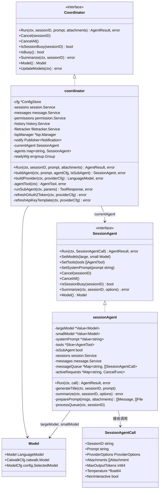
```mermaid
classDiagram
    class Coordinator {
        <<interface>>
        +Run(ctx, sessionID, prompt, attachments) AgentResult, error
        +Cancel(sessionID)
        +CancelAll()
        +IsSessionBusy(sessionID) bool
        +IsBusy() bool
        +Summarize(ctx, sessionID) error
        +Model() Model
        +UpdateModels(ctx) error
    }

    class coordinator {
        -cfg *ConfigStore
        -sessions session.Service
        -messages message.Service
        -permissions permission.Service
        -history history.Service
        -filetracker filetracker.Service
        -lspManager *lsp.Manager
        -notify Publisher~Notification~
        -currentAgent SessionAgent
        -agents map~string, SessionAgent~
        -readyWg errgroup.Group
        +Run(ctx, sessionID, prompt, attachments) AgentResult, error
        +buildAgent(ctx, prompt, agentCfg, isSubAgent) SessionAgent, error
        +buildProvider(ctx, providerCfg) LanguageModel, error
        -agentTool(ctx) AgentTool, error
        -runSubAgent(ctx, params) ToolResponse, error
        -refreshOAuth2Token(ctx, providerCfg) error
        -refreshApiKeyTemplate(ctx, providerCfg) error
    }

    class SessionAgent {
        <<interface>>
        +Run(ctx, SessionAgentCall) AgentResult, error
        +SetModels(large, small Model)
        +SetTools(tools []AgentTool)
        +SetSystemPrompt(prompt string)
        +Cancel(sessionID)
        +CancelAll()
        +IsSessionBusy(sessionID) bool
        +Summarize(ctx, sessionID, options) error
        +Model() Model
    }

    class sessionAgent {
        -largeModel *Value~Model~
        -smallModel *Value~Model~
        -systemPrompt *Value~string~
        -tools *Slice~AgentTool~
        -isSubAgent bool
        -sessions session.Service
        -messages message.Service
        -messageQueue *Map~string, []SessionAgentCall~
        -activeRequests *Map~string, CancelFunc~
        +Run(ctx, call) AgentResult, error
        -generateTitle(ctx, sessionID, prompt)
        -summarize(ctx, sessionID, options) error
        -preparePrompt(msgs, attachments) []Message, []File
        -processQueue(ctx, sessionID)
    }

    class Model {
        +Model LanguageModel
        +CatwalkCfg catwalk.Model
        +ModelCfg config.SelectedModel
    }

    class SessionAgentCall {
        +SessionID string
        +Prompt string
        +ProviderOptions ProviderOptions
        +Attachments []Attachment
        +MaxOutputTokens int64
        +Temperature *float64
        +NonInteractive bool
    }

    Coordinator <|.. coordinator
    SessionAgent <|.. sessionAgent
    coordinator --> SessionAgent : currentAgent
    coordinator --> Model
    sessionAgent --> Model : largeModel, smallModel
    sessionAgent --> SessionAgentCall : 接收调用
```

**设计模式**：
- **策略模式**：`Coordinator.buildProvider()` 根据提供商类型动态构建不同的 LLM 客户端
- **代理模式**：`Coordinator.Run()` 代理 `SessionAgent.Run()`，增加了 OAuth 刷新、401 重试等横切关注点
- **队列模式**：`sessionAgent.messageQueue` 实现同一会话的请求排队
- **观察者模式**：通过 `pubsub.Broker` 实现消息/会话变更的事件通知

### 4.2 App 模块（应用生命周期管理）

App 是整个应用的**组装中心**，负责：
1. 创建和注入所有服务实例
2. 建立事件订阅管道（Service → App.events channel → TUI Program）
3. 管理应用的优雅关闭

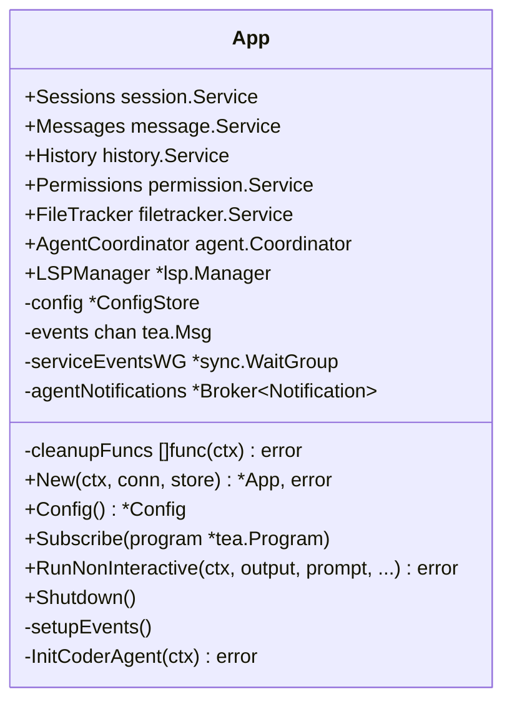
```mermaid
classDiagram
    class App {
        +Sessions session.Service
        +Messages message.Service
        +History history.Service
        +Permissions permission.Service
        +FileTracker filetracker.Service
        +AgentCoordinator agent.Coordinator
        +LSPManager *lsp.Manager
        -config *ConfigStore
        -events chan tea.Msg
        -serviceEventsWG *sync.WaitGroup
        -cleanupFuncs []func(ctx) error
        -agentNotifications *Broker~Notification~
        +New(ctx, conn, store) *App, error
        +Config() *Config
        +Subscribe(program *tea.Program)
        +RunNonInteractive(ctx, output, prompt, ...) error
        +Shutdown()
        -setupEvents()
        -InitCoderAgent(ctx) error
    }
```

**事件管道架构**：

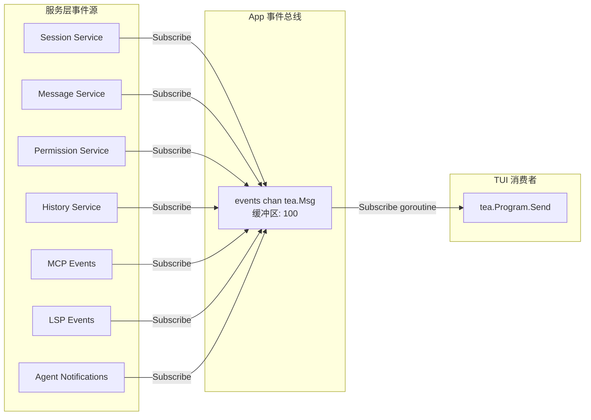
```mermaid
graph LR
    subgraph "服务层事件源"
        S1[Session Service]
        S2[Message Service]
        S3[Permission Service]
        S4[History Service]
        S5[MCP Events]
        S6[LSP Events]
        S7[Agent Notifications]
    end

    subgraph "App 事件总线"
        CH[events chan tea.Msg<br/>缓冲区: 100]
    end

    subgraph "TUI 消费者"
        P[tea.Program.Send]
    end

    S1 -->|Subscribe| CH
    S2 -->|Subscribe| CH
    S3 -->|Subscribe| CH
    S4 -->|Subscribe| CH
    S5 -->|Subscribe| CH
    S6 -->|Subscribe| CH
    S7 -->|Subscribe| CH
    CH -->|Subscribe goroutine| P
```

### 4.3 Config 模块（配置管理）

配置系统采用**多层合并策略**，支持从多个来源加载和合并配置。

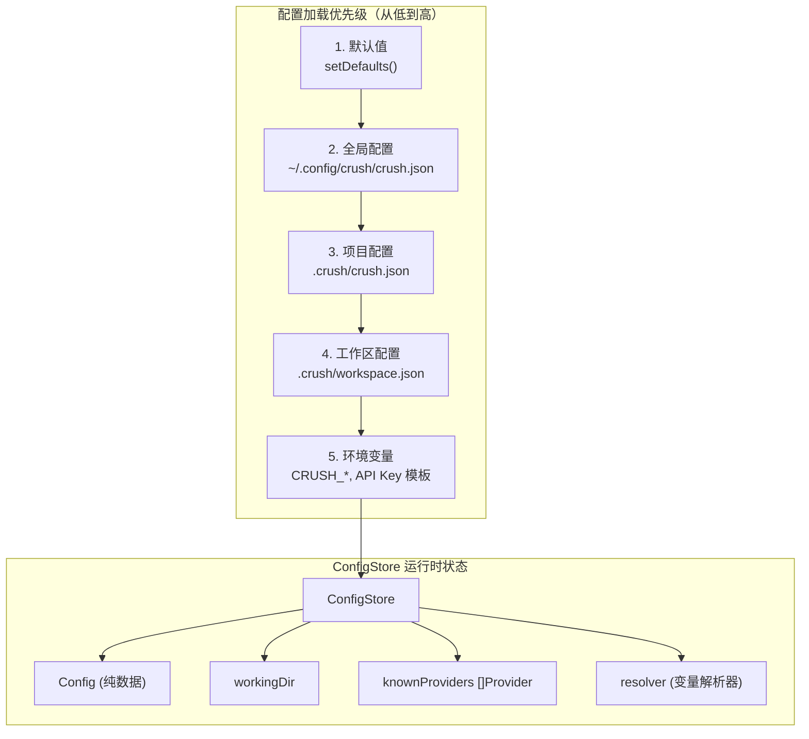
```mermaid
graph TB
    subgraph "配置加载优先级（从低到高）"
        direction TB
        A["1. 默认值<br/>setDefaults()"] --> B["2. 全局配置<br/>~/.config/crush/crush.json"]
        B --> C["3. 项目配置<br/>.crush/crush.json"]
        C --> D["4. 工作区配置<br/>.crush/workspace.json"]
        D --> E["5. 环境变量<br/>CRUSH_*, API Key 模板"]
    end

    subgraph "ConfigStore 运行时状态"
        CS["ConfigStore"]
        CS --> CFG["Config (纯数据)"]
        CS --> WD["workingDir"]
        CS --> KP["knownProviders []Provider"]
        CS --> RES["resolver (变量解析器)"]
    end

    E --> CS
```

**关键设计**：
- `Config` 是纯数据结构，`ConfigStore` 持有运行时状态
- API Key 支持 `$ENV_VAR` 模板语法，运行时动态解析
- 提供商配置支持 OAuth Token 和 API Key 两种认证方式
- 通过 Catwalk 服务获取模型元数据（上下文窗口、费用等）

### 4.4 UI 模块（终端界面）

UI 基于 **Bubble Tea 的 Elm 架构**（Model-Update-View），采用组件化设计。

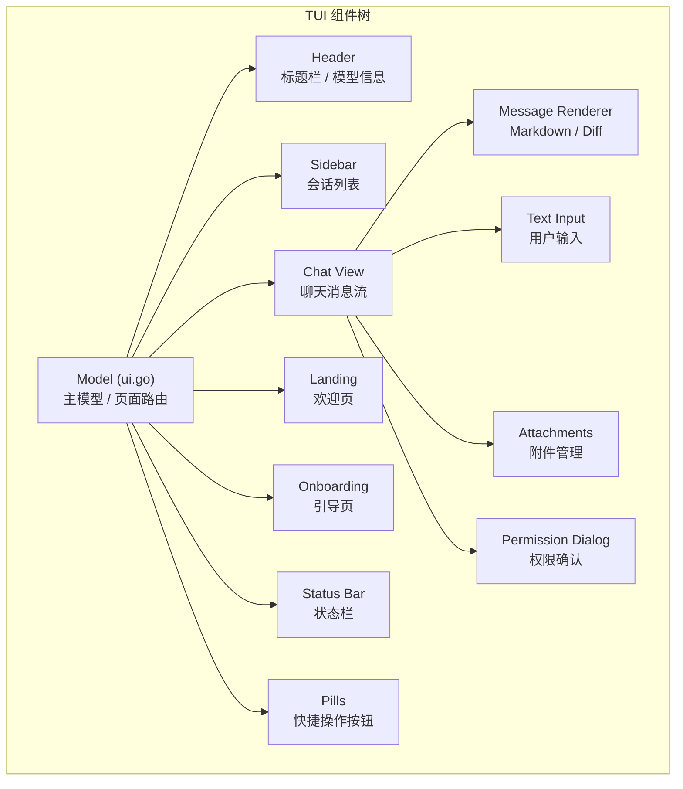
```mermaid
graph TB
    subgraph "TUI 组件树"
        ROOT["Model (ui.go)<br/>主模型 / 页面路由"]
        ROOT --> HEADER["Header<br/>标题栏 / 模型信息"]
        ROOT --> SIDEBAR["Sidebar<br/>会话列表"]
        ROOT --> CHAT["Chat View<br/>聊天消息流"]
        ROOT --> LANDING["Landing<br/>欢迎页"]
        ROOT --> ONBOARD["Onboarding<br/>引导页"]
        ROOT --> STATUS["Status Bar<br/>状态栏"]
        ROOT --> PILLS["Pills<br/>快捷操作按钮"]

        CHAT --> MSGRENDER["Message Renderer<br/>Markdown / Diff"]
        CHAT --> INPUT["Text Input<br/>用户输入"]
        CHAT --> ATTACH["Attachments<br/>附件管理"]
        CHAT --> DIALOG["Permission Dialog<br/>权限确认"]
    end
```

**关键特性**：
- 主模型 `ui.go` 约 96KB，是整个 TUI 的核心状态机
- 通过 `MouseEventFilter` 实现焦点感知的鼠标事件过滤
- 支持 Glamour Markdown 渲染、代码高亮、Diff 视图
- 事件驱动：通过 `App.Subscribe()` 接收服务层事件并更新 UI

### 4.5 DB 模块（数据持久化）

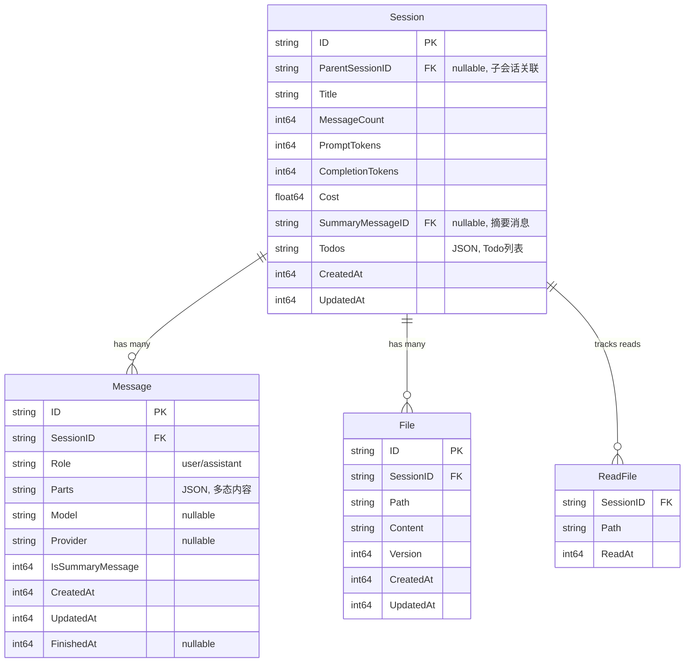
```mermaid
erDiagram
    Session ||--o{ Message : "has many"
    Session ||--o{ File : "has many"
    Session ||--o{ ReadFile : "tracks reads"
    Session {
        string ID PK
        string ParentSessionID FK "nullable, 子会话关联"
        string Title
        int64 MessageCount
        int64 PromptTokens
        int64 CompletionTokens
        float64 Cost
        string SummaryMessageID FK "nullable, 摘要消息"
        string Todos "JSON, Todo列表"
        int64 CreatedAt
        int64 UpdatedAt
    }
    Message {
        string ID PK
        string SessionID FK
        string Role "user/assistant"
        string Parts "JSON, 多态内容"
        string Model "nullable"
        string Provider "nullable"
        int64 IsSummaryMessage
        int64 CreatedAt
        int64 UpdatedAt
        int64 FinishedAt "nullable"
    }
    File {
        string ID PK
        string SessionID FK
        string Path
        string Content
        int64 Version
        int64 CreatedAt
        int64 UpdatedAt
    }
    ReadFile {
        string SessionID FK
        string Path
        int64 ReadAt
    }
```

**设计特点**：
- 使用 **sqlc** 从 SQL 文件生成类型安全的 Go 代码
- 使用 **Goose** 管理数据库迁移
- 支持两种 SQLite 驱动：`ncruces`（默认，基于 WASM）和 `modernc`（纯 Go）
- Message 的 `Parts` 字段使用 JSON 存储多态内容（文本、推理、工具调用、工具结果、图片等）

---

## 5. 并发模型

### 5.1 csync 包 — 并发安全数据结构

csync 包提供了三种核心并发安全数据结构，替代直接使用 `sync.Mutex`：

| 类型 | 用途 | 底层实现 |
|------|------|----------|
| `csync.Map[K, V]` | 并发安全的泛型 Map | `sync.RWMutex` + `map[K]V` |
| `csync.Slice[T]` | 并发安全的泛型切片 | `sync.RWMutex` + `[]T` |
| `csync.Value[T]` | 并发安全的单值容器 | `sync.RWMutex` + `T` |

**设计动机**：相比 `sync.Mutex`，csync 提供了：
- 类型安全的泛型 API，避免 `interface{}` 类型断言
- 读写锁分离（`RWMutex`），提高读多写少场景的并发性能
- 内置 `LazyMap` 支持延迟加载
- JSON 序列化/反序列化支持
- 迭代器（`iter.Seq`/`iter.Seq2`）支持

**在 Agent 中的应用**：

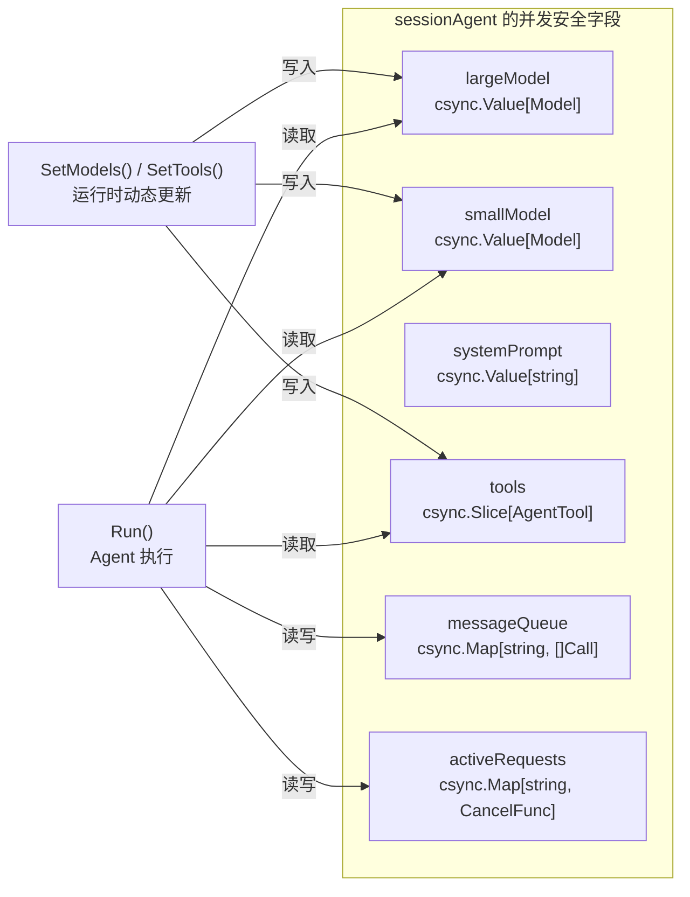
```mermaid
graph LR
    subgraph "sessionAgent 的并发安全字段"
        LM["largeModel<br/>csync.Value[Model]"]
        SM["smallModel<br/>csync.Value[Model]"]
        SP["systemPrompt<br/>csync.Value[string]"]
        T["tools<br/>csync.Slice[AgentTool]"]
        MQ["messageQueue<br/>csync.Map[string, []Call]"]
        AR["activeRequests<br/>csync.Map[string, CancelFunc]"]
    end

    SET["SetModels() / SetTools()<br/>运行时动态更新"] -->|写入| LM
    SET -->|写入| SM
    SET -->|写入| T

    RUN["Run()<br/>Agent 执行"] -->|读取| LM
    RUN -->|读取| SM
    RUN -->|读取| T
    RUN -->|读写| MQ
    RUN -->|读写| AR
```

### 5.2 pubsub 包 — 事件发布订阅

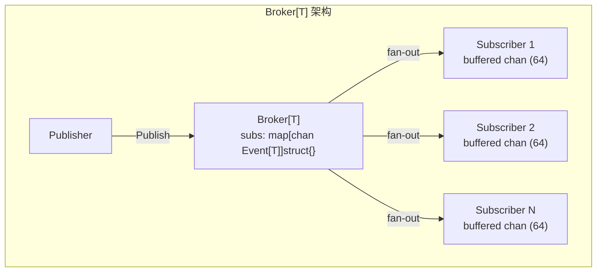
```mermaid
graph TB
    subgraph "Broker[T] 架构"
        PUB["Publisher"] -->|Publish| BROKER["Broker[T]<br/>subs: map[chan Event[T]]struct{}"]
        BROKER -->|fan-out| SUB1["Subscriber 1<br/>buffered chan (64)"]
        BROKER -->|fan-out| SUB2["Subscriber 2<br/>buffered chan (64)"]
        BROKER -->|fan-out| SUB3["Subscriber N<br/>buffered chan (64)"]
    end
```

**关键设计**：
- 泛型实现，支持任意类型的事件载荷
- 缓冲通道（64），防止慢消费者阻塞发布者
- 通道满时丢弃事件（非阻塞发布），保证发布者不被阻塞
- 通过 `context.Context` 管理订阅生命周期，自动清理

### 5.3 消息排队机制

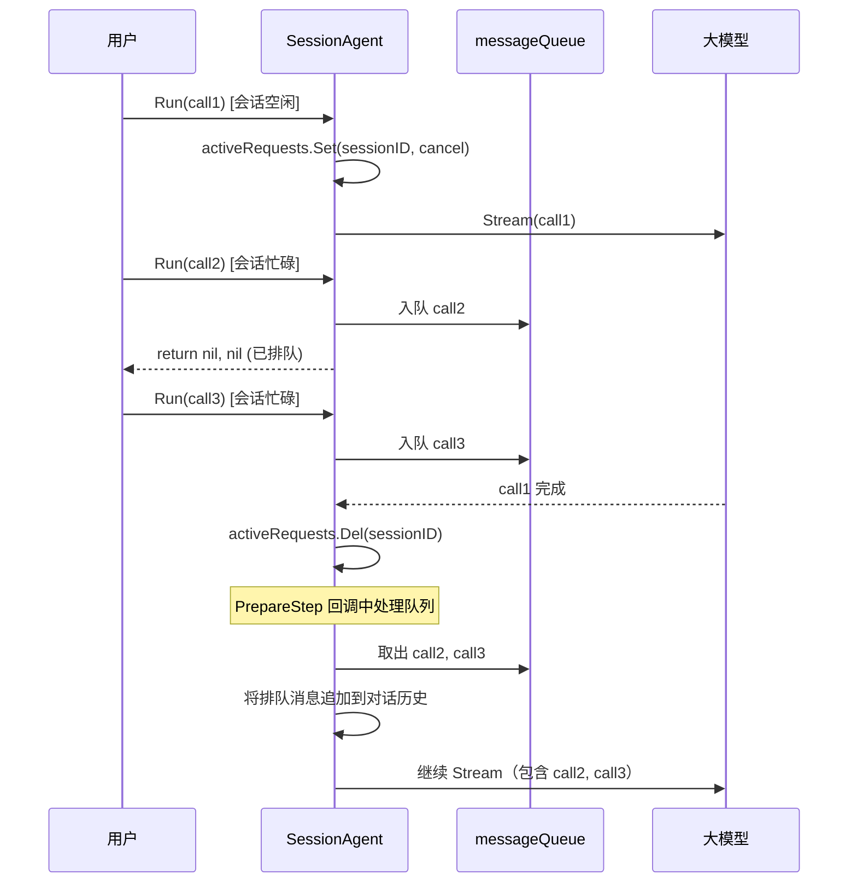
```mermaid
sequenceDiagram
    participant User as 用户
    participant SA as SessionAgent
    participant MQ as messageQueue
    participant LLM as 大模型

    User->>SA: Run(call1) [会话空闲]
    SA->>SA: activeRequests.Set(sessionID, cancel)
    SA->>LLM: Stream(call1)

    User->>SA: Run(call2) [会话忙碌]
    SA->>MQ: 入队 call2
    SA-->>User: return nil, nil (已排队)

    User->>SA: Run(call3) [会话忙碌]
    SA->>MQ: 入队 call3

    LLM-->>SA: call1 完成
    SA->>SA: activeRequests.Del(sessionID)

    Note over SA: PrepareStep 回调中处理队列
    SA->>MQ: 取出 call2, call3
    SA->>SA: 将排队消息追加到对话历史
    SA->>LLM: 继续 Stream（包含 call2, call3）
```

### 5.4 活跃请求管理

- 每个会话最多一个活跃请求，通过 `activeRequests` Map 管理
- `Cancel(sessionID)` 调用对应的 `context.CancelFunc` 取消请求
- `CancelAll()` 遍历所有活跃请求并取消
- 请求完成后自动从 Map 中移除

---

## 6. 核心调用链路

### 6.1 用户发送消息的完整链路

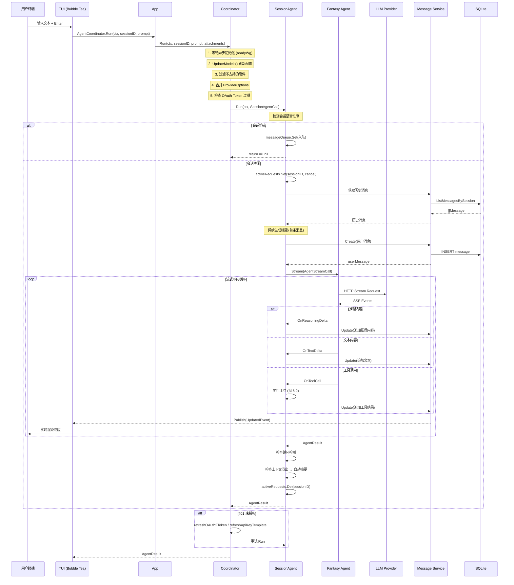
```mermaid
sequenceDiagram
    participant User as 用户终端
    participant TUI as TUI (Bubble Tea)
    participant App as App
    participant Coord as Coordinator
    participant SA as SessionAgent
    participant Fantasy as Fantasy Agent
    participant LLM as LLM Provider
    participant MsgSvc as Message Service
    participant DB as SQLite

    User->>TUI: 输入文本 + Enter
    TUI->>App: AgentCoordinator.Run(ctx, sessionID, prompt)
    App->>Coord: Run(ctx, sessionID, prompt, attachments)

    Note over Coord: 1. 等待异步初始化 (readyWg)
    Note over Coord: 2. UpdateModels() 刷新配置
    Note over Coord: 3. 过滤不支持的附件
    Note over Coord: 4. 合并 ProviderOptions
    Note over Coord: 5. 检查 OAuth Token 过期

    Coord->>SA: Run(ctx, SessionAgentCall)

    Note over SA: 检查会话是否忙碌
    alt 会话忙碌
        SA->>SA: messageQueue.Set(入队)
        SA-->>Coord: return nil, nil
    else 会话空闲
        SA->>SA: activeRequests.Set(sessionID, cancel)
        SA->>MsgSvc: 获取历史消息
        MsgSvc->>DB: ListMessagesBySession
        DB-->>MsgSvc: []Message
        MsgSvc-->>SA: 历史消息

        Note over SA: 异步生成标题 (首条消息)

        SA->>MsgSvc: Create(用户消息)
        MsgSvc->>DB: INSERT message
        MsgSvc-->>SA: userMessage

        SA->>Fantasy: Stream(AgentStreamCall)

        loop 流式响应循环
            Fantasy->>LLM: HTTP Stream Request
            LLM-->>Fantasy: SSE Events

            alt 推理内容
                Fantasy->>SA: OnReasoningDelta
                SA->>MsgSvc: Update(追加推理内容)
            else 文本内容
                Fantasy->>SA: OnTextDelta
                SA->>MsgSvc: Update(追加文本)
            else 工具调用
                Fantasy->>SA: OnToolCall
                SA->>SA: 执行工具 (见 6.2)
                SA->>MsgSvc: Update(追加工具结果)
            end

            MsgSvc-->>TUI: Publish(UpdatedEvent)
            TUI->>User: 实时渲染响应
        end

        Fantasy-->>SA: AgentResult
        SA->>SA: 检查循环检测
        SA->>SA: 检查上下文溢出 → 自动摘要
        SA->>SA: activeRequests.Del(sessionID)
        SA-->>Coord: AgentResult
    end

    alt 401 未授权
        Coord->>Coord: refreshOAuth2Token / refreshApiKeyTemplate
        Coord->>SA: 重试 Run
    end

    Coord-->>TUI: AgentResult
```

### 6.2 工具调用链路

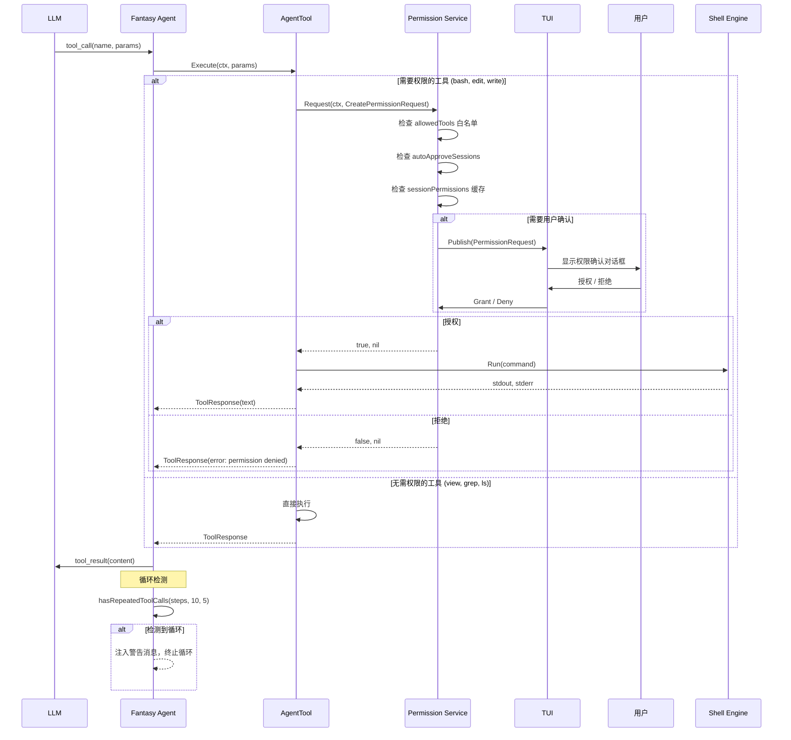
```mermaid
sequenceDiagram
    participant LLM as LLM
    participant Fantasy as Fantasy Agent
    participant Tool as AgentTool
    participant Perm as Permission Service
    participant TUI as TUI
    participant User as 用户
    participant Shell as Shell Engine

    LLM->>Fantasy: tool_call(name, params)
    Fantasy->>Tool: Execute(ctx, params)

    alt 需要权限的工具 (bash, edit, write)
        Tool->>Perm: Request(ctx, CreatePermissionRequest)
        Perm->>Perm: 检查 allowedTools 白名单
        Perm->>Perm: 检查 autoApproveSessions
        Perm->>Perm: 检查 sessionPermissions 缓存

        alt 需要用户确认
            Perm->>TUI: Publish(PermissionRequest)
            TUI->>User: 显示权限确认对话框
            User->>TUI: 授权 / 拒绝
            TUI->>Perm: Grant / Deny
        end

        alt 授权
            Perm-->>Tool: true, nil
            Tool->>Shell: Run(command)
            Shell-->>Tool: stdout, stderr
            Tool-->>Fantasy: ToolResponse(text)
        else 拒绝
            Perm-->>Tool: false, nil
            Tool-->>Fantasy: ToolResponse(error: permission denied)
        end
    else 无需权限的工具 (view, grep, ls)
        Tool->>Tool: 直接执行
        Tool-->>Fantasy: ToolResponse
    end

    Fantasy->>LLM: tool_result(content)

    Note over Fantasy: 循环检测
    Fantasy->>Fantasy: hasRepeatedToolCalls(steps, 10, 5)
    alt 检测到循环
        Fantasy-->>Fantasy: 注入警告消息，终止循环
    end
```

### 6.3 子代理调用链路

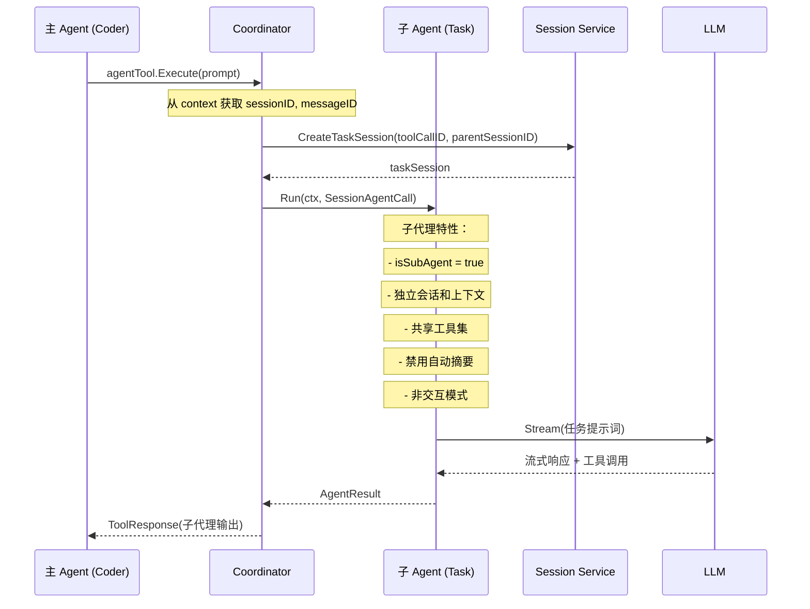
```mermaid
sequenceDiagram
    participant MainAgent as 主 Agent (Coder)
    participant Coord as Coordinator
    participant SubAgent as 子 Agent (Task)
    participant SessSvc as Session Service
    participant LLM as LLM

    MainAgent->>Coord: agentTool.Execute(prompt)

    Note over Coord: 从 context 获取 sessionID, messageID

    Coord->>SessSvc: CreateTaskSession(toolCallID, parentSessionID)
    SessSvc-->>Coord: taskSession

    Coord->>SubAgent: Run(ctx, SessionAgentCall)

    Note over SubAgent: 子代理特性：
    Note over SubAgent: - isSubAgent = true
    Note over SubAgent: - 独立会话和上下文
    Note over SubAgent: - 共享工具集
    Note over SubAgent: - 禁用自动摘要
    Note over SubAgent: - 非交互模式

    SubAgent->>LLM: Stream(任务提示词)
    LLM-->>SubAgent: 流式响应 + 工具调用
    SubAgent-->>Coord: AgentResult

    Coord-->>MainAgent: ToolResponse(子代理输出)
```

### 6.4 配置加载和应用初始化链路

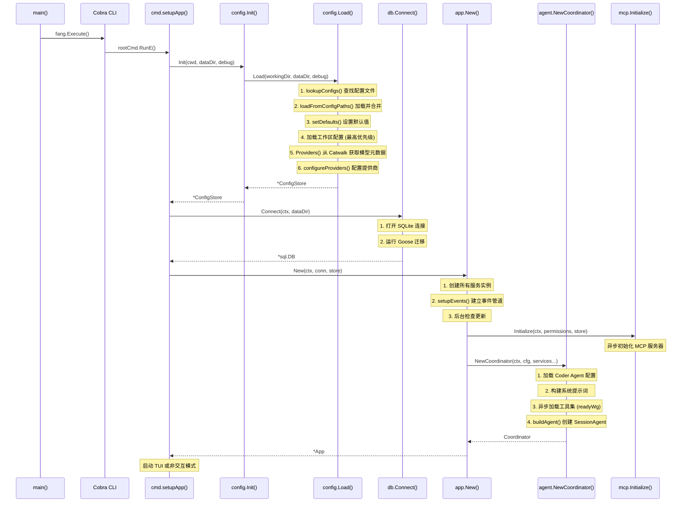
```mermaid
sequenceDiagram
    participant Main as main()
    participant Cobra as Cobra CLI
    participant Cmd as cmd.setupApp()
    participant Config as config.Init()
    participant Load as config.Load()
    participant DB as db.Connect()
    participant App as app.New()
    participant Agent as agent.NewCoordinator()
    participant MCP as mcp.Initialize()

    Main->>Cobra: fang.Execute()
    Cobra->>Cmd: rootCmd.RunE()
    Cmd->>Config: Init(cwd, dataDir, debug)
    Config->>Load: Load(workingDir, dataDir, debug)

    Note over Load: 1. lookupConfigs() 查找配置文件
    Note over Load: 2. loadFromConfigPaths() 加载并合并
    Note over Load: 3. setDefaults() 设置默认值
    Note over Load: 4. 加载工作区配置 (最高优先级)
    Note over Load: 5. Providers() 从 Catwalk 获取模型元数据
    Note over Load: 6. configureProviders() 配置提供商

    Load-->>Config: *ConfigStore
    Config-->>Cmd: *ConfigStore

    Cmd->>DB: Connect(ctx, dataDir)
    Note over DB: 1. 打开 SQLite 连接
    Note over DB: 2. 运行 Goose 迁移

    DB-->>Cmd: *sql.DB

    Cmd->>App: New(ctx, conn, store)
    Note over App: 1. 创建所有服务实例
    Note over App: 2. setupEvents() 建立事件管道
    Note over App: 3. 后台检查更新

    App->>MCP: Initialize(ctx, permissions, store)
    Note over MCP: 异步初始化 MCP 服务器

    App->>Agent: NewCoordinator(ctx, cfg, services...)
    Note over Agent: 1. 加载 Coder Agent 配置
    Note over Agent: 2. 构建系统提示词
    Note over Agent: 3. 异步加载工具集 (readyWg)
    Note over Agent: 4. buildAgent() 创建 SessionAgent

    Agent-->>App: Coordinator
    App-->>Cmd: *App

    Note over Cmd: 启动 TUI 或非交互模式
```

### 6.5 会话摘要链路

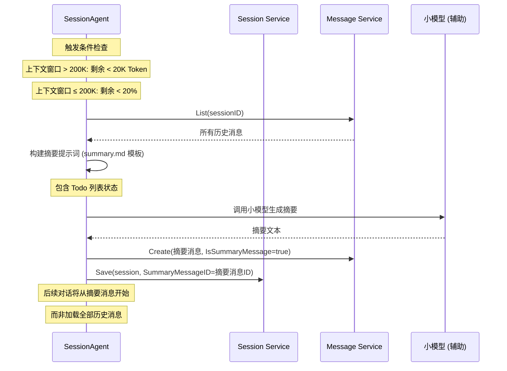
```mermaid
sequenceDiagram
    participant SA as SessionAgent
    participant SessSvc as Session Service
    participant MsgSvc as Message Service
    participant SmallLLM as 小模型 (辅助)

    Note over SA: 触发条件检查
    Note over SA: 上下文窗口 > 200K: 剩余 < 20K Token
    Note over SA: 上下文窗口 ≤ 200K: 剩余 < 20%

    SA->>MsgSvc: List(sessionID)
    MsgSvc-->>SA: 所有历史消息

    SA->>SA: 构建摘要提示词 (summary.md 模板)
    Note over SA: 包含 Todo 列表状态

    SA->>SmallLLM: 调用小模型生成摘要
    SmallLLM-->>SA: 摘要文本

    SA->>MsgSvc: Create(摘要消息, IsSummaryMessage=true)
    SA->>SessSvc: Save(session, SummaryMessageID=摘要消息ID)

    Note over SA: 后续对话将从摘要消息开始
    Note over SA: 而非加载全部历史消息
```

---

## 7. 工具系统架构

### 7.1 工具分类

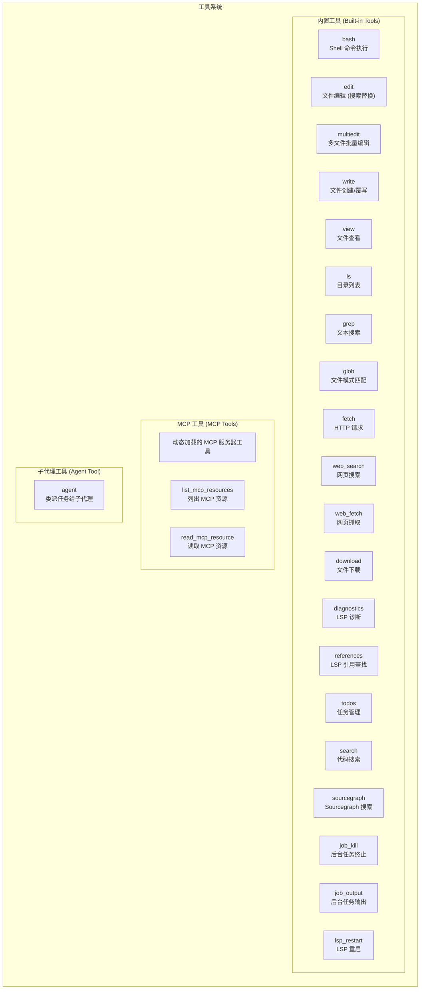
```mermaid
graph TB
    subgraph "工具系统"
        direction TB

        subgraph "内置工具 (Built-in Tools)"
            BASH["bash<br/>Shell 命令执行"]
            EDIT["edit<br/>文件编辑 (搜索替换)"]
            MULTIEDIT["multiedit<br/>多文件批量编辑"]
            WRITE["write<br/>文件创建/覆写"]
            VIEW["view<br/>文件查看"]
            LS["ls<br/>目录列表"]
            GREP["grep<br/>文本搜索"]
            GLOB["glob<br/>文件模式匹配"]
            FETCH["fetch<br/>HTTP 请求"]
            WEB_SEARCH["web_search<br/>网页搜索"]
            WEB_FETCH["web_fetch<br/>网页抓取"]
            DOWNLOAD["download<br/>文件下载"]
            DIAG["diagnostics<br/>LSP 诊断"]
            REF["references<br/>LSP 引用查找"]
            TODOS["todos<br/>任务管理"]
            SEARCH["search<br/>代码搜索"]
            SG["sourcegraph<br/>Sourcegraph 搜索"]
            JOB_KILL["job_kill<br/>后台任务终止"]
            JOB_OUTPUT["job_output<br/>后台任务输出"]
            LSP_RESTART["lsp_restart<br/>LSP 重启"]
        end

        subgraph "MCP 工具 (MCP Tools)"
            MCP_TOOLS["动态加载的 MCP 服务器工具"]
            MCP_RES["list_mcp_resources<br/>列出 MCP 资源"]
            MCP_READ["read_mcp_resource<br/>读取 MCP 资源"]
        end

        subgraph "子代理工具 (Agent Tool)"
            AGENT_TOOL["agent<br/>委派任务给子代理"]
        end
    end
```

### 7.2 工具执行上下文

工具通过 `context.Context` 传递运行时信息：

| Context Key | 类型 | 用途 |
|-------------|------|------|
| `SessionIDContextKey` | `string` | 当前会话 ID |
| `MessageIDContextKey` | `string` | 当前助手消息 ID |
| `SupportsImagesContextKey` | `bool` | 模型是否支持图片 |
| `ModelNameContextKey` | `string` | 当前模型名称 |

---

## 8. 提供商抽象架构

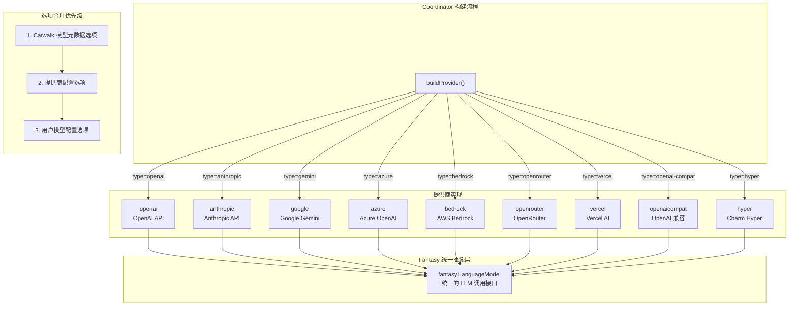
```mermaid
graph TB
    subgraph "Fantasy 统一抽象层"
        FANTASY["fantasy.LanguageModel<br/>统一的 LLM 调用接口"]
    end

    subgraph "提供商实现"
        OPENAI["openai<br/>OpenAI API"]
        ANTHROPIC["anthropic<br/>Anthropic API"]
        GOOGLE["google<br/>Google Gemini"]
        AZURE["azure<br/>Azure OpenAI"]
        BEDROCK["bedrock<br/>AWS Bedrock"]
        OPENROUTER["openrouter<br/>OpenRouter"]
        VERCEL["vercel<br/>Vercel AI"]
        COMPAT["openaicompat<br/>OpenAI 兼容"]
        HYPER["hyper<br/>Charm Hyper"]
    end

    subgraph "Coordinator 构建流程"
        BUILD["buildProvider()"]
        BUILD -->|type=openai| OPENAI
        BUILD -->|type=anthropic| ANTHROPIC
        BUILD -->|type=gemini| GOOGLE
        BUILD -->|type=azure| AZURE
        BUILD -->|type=bedrock| BEDROCK
        BUILD -->|type=openrouter| OPENROUTER
        BUILD -->|type=vercel| VERCEL
        BUILD -->|type=openai-compat| COMPAT
        BUILD -->|type=hyper| HYPER
    end

    OPENAI --> FANTASY
    ANTHROPIC --> FANTASY
    GOOGLE --> FANTASY
    AZURE --> FANTASY
    BEDROCK --> FANTASY
    OPENROUTER --> FANTASY
    VERCEL --> FANTASY
    COMPAT --> FANTASY
    HYPER --> FANTASY

    subgraph "选项合并优先级"
        direction TB
        P1["1. Catwalk 模型元数据选项"] --> P2["2. 提供商配置选项"]
        P2 --> P3["3. 用户模型配置选项"]
    end
```

---

## 9. 关键设计决策总结

| # | 决策 | 理由 |
|---|------|------|
| 1 | **两级 Agent 架构** (Coordinator + SessionAgent) | 分离全局关注点（OAuth、配置刷新）和会话级关注点（消息管理、工具执行） |
| 2 | **csync 替代 sync.Mutex** | 提供类型安全的泛型 API、读写锁分离、JSON 序列化支持 |
| 3 | **pubsub 泛型事件总线** | 解耦服务层和 UI 层，支持多订阅者，非阻塞发布 |
| 4 | **SQLite + sqlc** | 嵌入式零配置 + 类型安全的 SQL 代码生成，适合本地桌面应用 |
| 5 | **Fantasy 统一 LLM 抽象** | 屏蔽 9+ 提供商的 API 差异，统一流式调用接口 |
| 6 | **消息排队而非拒绝** | 同一会话的并发请求自动排队，不丢失用户输入 |
| 7 | **自动摘要机制** | 根据上下文窗口使用量动态触发，避免 Token 溢出 |
| 8 | **循环检测** (SHA-256 签名) | 检查最近 10 步中工具调用签名重复 > 5 次，防止 Agent 死循环 |
| 9 | **POSIX Shell 模拟** (mvdan.cc/sh) | 纯 Go 实现，跨平台兼容，避免依赖系统 Shell |
| 10 | **MCP 协议扩展** | 支持动态加载第三方工具，遵循开放标准 |

---

## 10. 部署架构

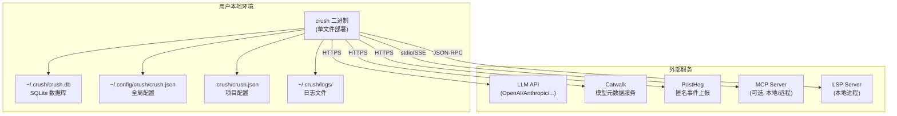
```mermaid
graph TB
    subgraph "用户本地环境"
        CRUSH["crush 二进制<br/>(单文件部署)"]
        SQLITE["~/.crush/crush.db<br/>SQLite 数据库"]
        CONFIG["~/.config/crush/crush.json<br/>全局配置"]
        PROJ_CONFIG[".crush/crush.json<br/>项目配置"]
        LOGS["~/.crush/logs/<br/>日志文件"]

        CRUSH --> SQLITE
        CRUSH --> CONFIG
        CRUSH --> PROJ_CONFIG
        CRUSH --> LOGS
    end

    subgraph "外部服务"
        LLM_API["LLM API<br/>(OpenAI/Anthropic/...)"]
        CATWALK["Catwalk<br/>模型元数据服务"]
        POSTHOG["PostHog<br/>匿名事件上报"]
        MCP_SERVER["MCP Server<br/>(可选, 本地/远程)"]
        LSP_SERVER["LSP Server<br/>(本地进程)"]
    end

    CRUSH -->|HTTPS| LLM_API
    CRUSH -->|HTTPS| CATWALK
    CRUSH -->|HTTPS| POSTHOG
    CRUSH -->|stdio/SSE| MCP_SERVER
    CRUSH -->|JSON-RPC| LSP_SERVER
```

---

> **文档说明**：本文档基于 Crush 项目源码分析生成，所有架构图使用 Mermaid 语法。如需更新，请在代码结构发生重大变更时同步修改本文档。
